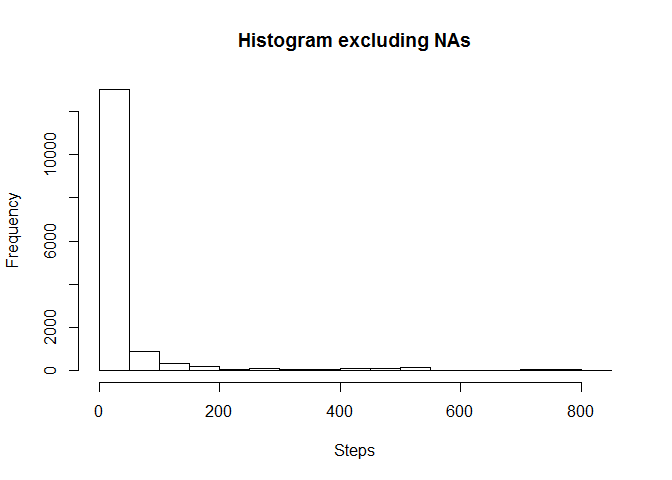
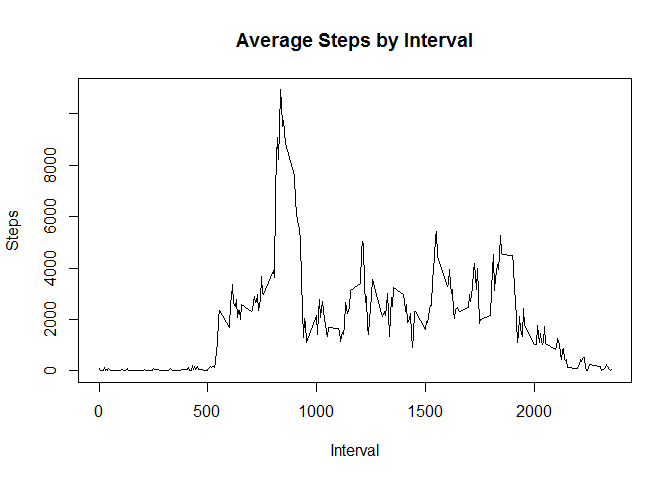
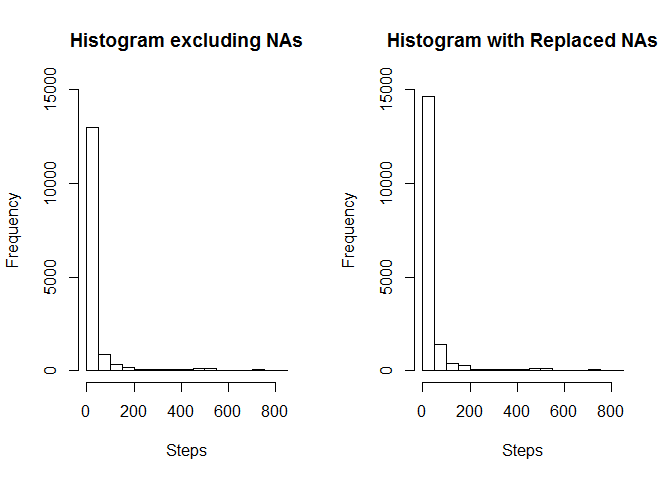

# Rep Research Project 1
Alia Eccles  
May 12, 2017  


First we prepare the code for analysis.


```r
act <- read.csv("activity.csv")
act$date <- as.Date(act$date)
```

##What is mean total number of steps taken per day?

Calculate the total number of steps taken per day


```r
agg <- aggregate(. ~ date, data=act, sum)[,1:2]
print(agg, type = "html")
```

```
##          date steps
## 1  2012-10-02   126
## 2  2012-10-03 11352
## 3  2012-10-04 12116
## 4  2012-10-05 13294
## 5  2012-10-06 15420
## 6  2012-10-07 11015
## 7  2012-10-09 12811
## 8  2012-10-10  9900
## 9  2012-10-11 10304
## 10 2012-10-12 17382
## 11 2012-10-13 12426
## 12 2012-10-14 15098
## 13 2012-10-15 10139
## 14 2012-10-16 15084
## 15 2012-10-17 13452
## 16 2012-10-18 10056
## 17 2012-10-19 11829
## 18 2012-10-20 10395
## 19 2012-10-21  8821
## 20 2012-10-22 13460
## 21 2012-10-23  8918
## 22 2012-10-24  8355
## 23 2012-10-25  2492
## 24 2012-10-26  6778
## 25 2012-10-27 10119
## 26 2012-10-28 11458
## 27 2012-10-29  5018
## 28 2012-10-30  9819
## 29 2012-10-31 15414
## 30 2012-11-02 10600
## 31 2012-11-03 10571
## 32 2012-11-05 10439
## 33 2012-11-06  8334
## 34 2012-11-07 12883
## 35 2012-11-08  3219
## 36 2012-11-11 12608
## 37 2012-11-12 10765
## 38 2012-11-13  7336
## 39 2012-11-15    41
## 40 2012-11-16  5441
## 41 2012-11-17 14339
## 42 2012-11-18 15110
## 43 2012-11-19  8841
## 44 2012-11-20  4472
## 45 2012-11-21 12787
## 46 2012-11-22 20427
## 47 2012-11-23 21194
## 48 2012-11-24 14478
## 49 2012-11-25 11834
## 50 2012-11-26 11162
## 51 2012-11-27 13646
## 52 2012-11-28 10183
## 53 2012-11-29  7047
```

Make a histogram of the total number of steps taken each day


```r
hist(act$steps, main = "Histogram excluding NAs", xlab = "Steps")
```

<!-- -->

Calculate and report the mean and median of the total number of steps taken per day


```r
meanact <- mean(act$steps, na.rm=TRUE)
medianact <- median(act$steps, na.rm=TRUE)
```

The mean is 37.3825996 and the median is 0.

##What is the average daily activity pattern?

Make a time series plot (i.e. type = "l") of the 5-minute interval (x-axis) and the average number of steps taken, averaged across all days (y-axis)


```r
int <- aggregate(. ~ interval, data=act, sum)[,1:2]
plot (int$interval, int$steps, type = "l", xlab= "Interval", ylab = "Steps", main = "Average Steps by Interval")
```

<!-- -->

```r
maxi <- max( int$interval[int$steps==max(int$steps)] )
```

Which 5-minute interval, on average across all the days in the dataset, contains the maximum number of steps?

The maximum number of steps happens at interval 835.

##Imputing missing values

###Note that there are a number of days/intervals where there are missing values (coded as NA). The presence of missing days may introduce bias into some calculations or summaries of the data.

Calculate and report the total number of missing values in the dataset (i.e. the total number of rows with NAs)


```r
miss <- sum(is.na(act$steps))
```

The number of missing values is 2304.

Devise a strategy for filling in all of the missing values in the dataset. The strategy does not need to be sophisticated. For example, you could use the mean/median for that day, or the mean for that 5-minute interval, etc.

Create a new dataset that is equal to the original dataset but with the missing data filled in.


```r
##Find the NAs
na <- which(is.na(act$steps), arr.ind=TRUE)
alt <- act
intavg <- aggregate(. ~ interval, data=act, mean)[,1:2]
alt <- merge(x = alt, y = intavg, by = "interval", all.x = TRUE)
##Replace the nas with the average for the interval
alt$steps.x[is.na(alt$steps.x)] <- alt$steps.y[is.na(alt$steps.x)]
names(alt)[names(alt)=="steps.x"] <- "steps"
alt <- alt[,1:3]
```

Make a histogram of the total number of steps taken each day 


```r
par(mfrow=c(1, 2))
hist(act$steps, main = "Histogram excluding NAs", xlab = "Steps", ylim = c(0,15000))
hist(alt$steps, main = "Histogram with Replaced NAs", xlab = "Steps", ylim = c(0,15000))
```

<!-- -->

Calculate and report the mean and median total number of steps taken per day. 


```r
meanalt <- mean(alt$steps, na.rm=TRUE)
medianalt <- median(alt$steps, na.rm=TRUE)
```
The mean changed from 37.3825996 to 37.3825996 and the median changed from 0 to 0.

Do these values differ from the estimates from the first part of the assignment? What is the impact of imputing missing data on the estimates of the total daily number of steps?

Nothing changed except that the aggregate frequency increased. 


##Are there differences in activity patterns between weekdays and weekends?

Create a new factor variable in the dataset with two levels - "weekday" and "weekend" indicating whether a given date is a weekday or weekend day.


```r
alt$day <- weekdays(alt$date)
alt$day[alt$day=="Sunday"|alt$day=="Saturday"]<-"Weekend"
alt$day[alt$day!="Weekend"]<-"Weekday"
```

Make a panel plot containing a time series plot (i.e. type = "l") of the 5-minute interval (x-axis) and the average number of steps taken, averaged across all weekday days or weekend days (y-axis). 


```r
library(lattice)
int1 <- aggregate(. ~ interval+day, data=alt, mean)[,1:3]
int1$day <- as.factor(int1$day)
xyplot(steps~interval|day, data = int1, type = 'l', layout = c(1,2))
```

<!-- -->
That's all, folks!

